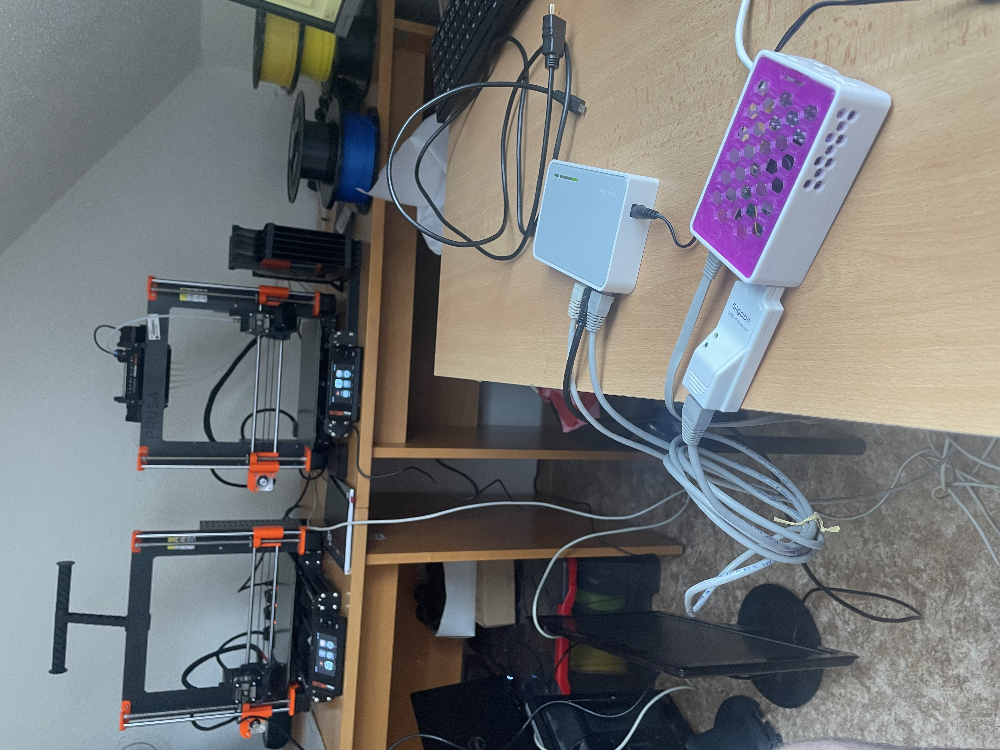
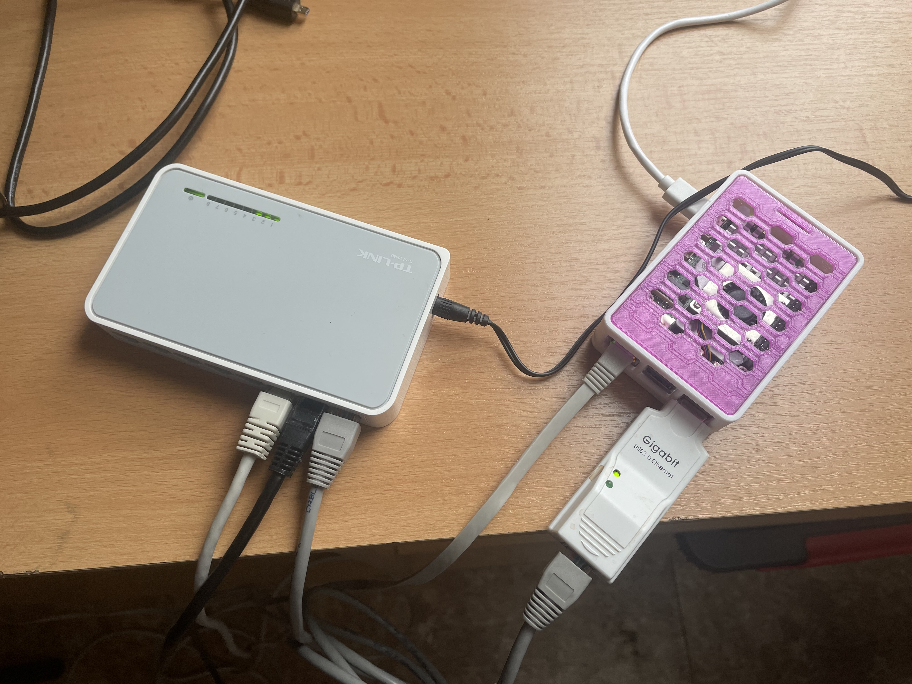

# PrusaLink-Raspberry-Pi-Printing-Gateway

Projekt pro vytvoření brány (gateway) pro vzdálené ovládání 3D tiskáren s firmwarem PrusaLink pomocí Raspberry Pi.  
Umožňuje bezpečný přístup k tiskárnám např. přes VPN a správu tiskáren v lokální síti s pomocí DHCP serveru, NAT a reverzní proxy (nginx).



---

## Přehled

- Raspberry Pi slouží jako síťový router a DHCP server pro lokální síť tiskáren.
- NAT směruje provoz mezi hlavní sítí (LAN) a podsítí tiskáren.
- Reverzní proxy nginx umožňuje bezpečný přístup k více tiskárnám přes specifické porty přes IP adresu Raspberry Pi.
- VPN propojení zajišťuje bezpečný vzdálený přístup (na vás).

---

## Hlavní vlastnosti

- Statická IP adresa na síťovém rozhraní připojeném k tiskárnám (eth1).
- DHCP server s přidělováním IP adres v podsíti tiskáren.
- Povolený IP forwarding a NAT mezi eth0 a eth1.
- Reverzní proxy nginx na portech 9091 a 9092 pro směrování na různé tiskárny.
- Podpora více tiskáren v rámci jedné brány.
- Jednoduchá konfigurace a automatizace instalace pomocí instalačního skriptu.

---

## Požadavky

- Raspberry Pi s OS Raspberry Pi OS (Debian-based).
- Připojení k internetu pro instalaci balíčků.
- Fyzická síťová rozhraní:  
  - `eth0` – připojení do hlavní LAN / VPN.  
  - `eth1` – připojení k tiskárnám (switch/Access Point).
- Připojené 3D tiskárny s PrusaLink IP adresami ve vyhrazené podsíti (např. 192.168.2.11, 192.168.2.12).
- Nutná manuální konfigurace IP adres pro nginx



---

## Instalace

Naklonujte repozitář nebo zkopírujte instalační skript:
 
 ```
sudo bash setup.sh
sudo reboot
 ```
 ---
 
## Konfigurace
 
- Statická IP adresa pro rozhraní eth1 je nastavena na `192.168.2.1/24`.
- DHCP server přiděluje adresy z rozsahu `192.168.2.10` až `192.168.2.20`.
- Reverzní proxy nginx směruje požadavky na portech `9091` a `9092` na tiskárny v podsíti.
- V případě změny IP adres tiskáren nebo připojení přizpůsobte soubor `/etc/nginx/sites-available/default`.

---

## Použití
Připojte se do vaší sítě (i přes VPN). Přistupujte k tiskárnám přes Raspberry Pi pomocí IP adresy Pi a portů 9091, 9092:

`
http://<ip_raspberry_pi>:9091  # První tiskárna
http://<ip_raspberry_pi>:9092  # Druhá tiskárna
`
