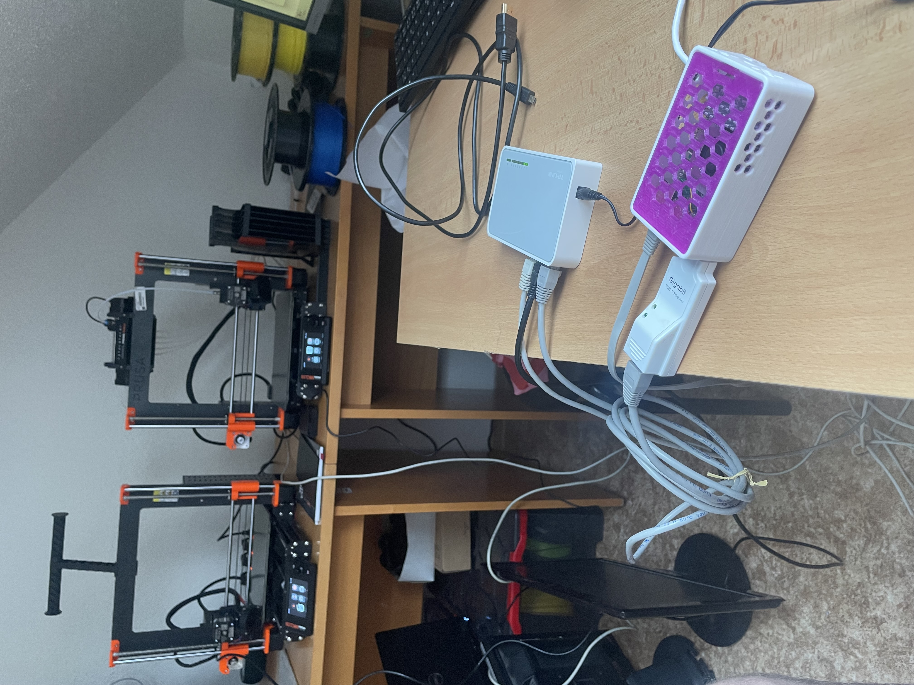
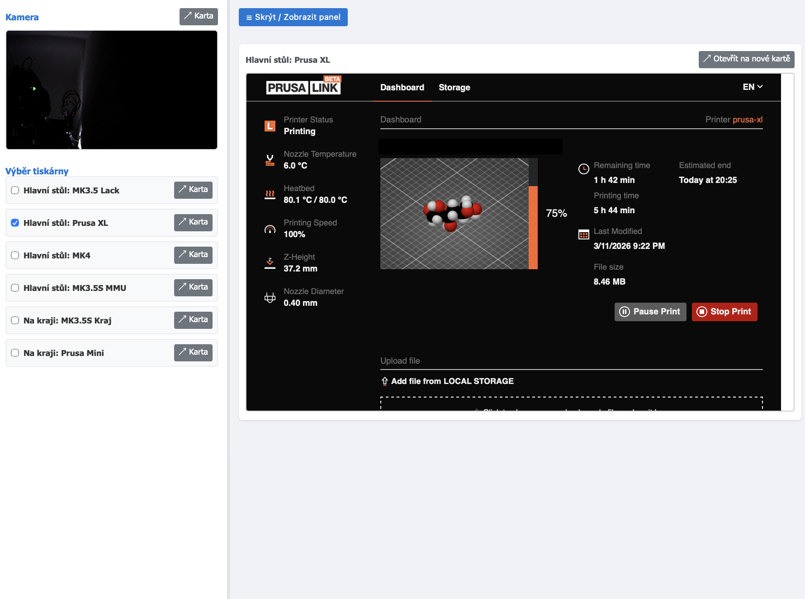
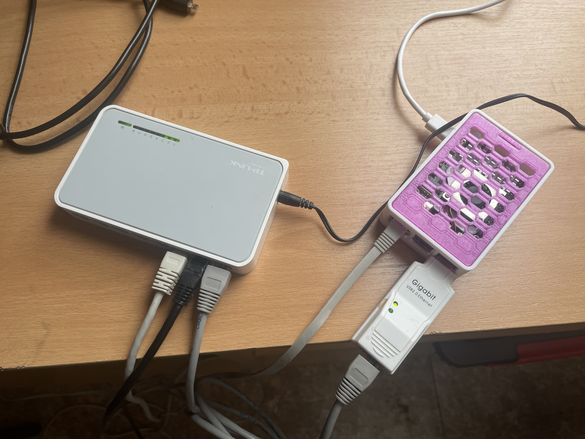

# PrusaLink-Raspberry-Pi-Printing-Gateway

Projekt pro vytvoření brány (gateway) pro vzdálené ovládání 3D tiskáren s firmwarem PrusaLink pomocí Raspberry Pi.  
Umožňuje bezpečný přístup k tiskárnám např. přes VPN a správu tiskáren v lokální síti s pomocí DHCP serveru (s rezervací IP dle MAC), NAT a reverzní proxy (nginx).





## Přehled

- Raspberry Pi slouží jako síťový router a DHCP server pro lokální síť tiskáren.
- NAT směruje provoz mezi hlavní sítí (LAN) a podsítí tiskáren.
- Reverzní proxy nginx umožňuje bezpečný přístup k více tiskárnám přes specifické porty přes IP adresu nebo doménu Raspberry Pi.
- VPN propojení zajišťuje bezpečný vzdálený přístup.
- Sítě spravuje spolehlivý NetworkManager namísto staršího dhcpcd.

## Hlavní vlastnosti

- Statická IP adresa na síťovém rozhraní připojeném k tiskárnám (eth1) nastavená přes `nmcli`.
- DHCP server přidělující statické IP adresy na základě MAC adres (předpřipraveno pro 6 tiskáren).
- Povolený IP forwarding a NAT mezi eth0 a eth1.
- Reverzní proxy nginx na portech 9091 až 9096 pro směrování na jednotlivé tiskárny.
- Podpora robustního běhu pomocí systemd override pravidel (automatické restarty DHCP serveru).
- Jednoduchá konfigurace a automatizace instalace pomocí instalačního skriptu.

## Hardware

- Raspberry Pi + chlazení, box
- SD karta (nebo jiný disk, např. HAT s nvme diskem)
- Zdroj (nebo HAT s podporou PoE)
- Ethernet Switch (+ jeho zdroj)
- USB Ethernet adaptér
- 3D tiskárny (např. Prusa MK4, XL, MINI, MK3.5)
- Ethernetové kabely

## Požadavky

- Raspberry Pi s OS Raspberry Pi OS (Debian-based).
- Připojení k internetu pro instalaci balíčků.
- Fyzická síťová rozhraní:  
  - `eth0` – připojení do hlavní LAN / VPN.  
  - `eth1` – připojení k tiskárnám (switch/Access Point).
- Připojené 3D tiskárny s povoleným PrusaLinkem.
- **Před spuštěním skriptu:** Upravte MAC adresy tiskáren v souboru `setup.sh` (sekce DHCP konfigurace), aby dostaly správně přidělené IP.



## Instalace

Naklonujte repozitář (nebo zkopírujte skript), upravte soubor `setup.sh` (doplňte MAC adresy) a spusťte:
 
```bash
sudo bash setup.sh
sudo reboot
```

## Konfigurace
 
- Statická IP adresa pro rozhraní eth1 je nastavena na `192.168.22.1/24`.
- DHCP server přiděluje pevné IP adresy pro registrované MAC od `192.168.22.11` výše. Dynamický rozsah je .10 až .50.
- Reverzní proxy nginx směruje požadavky na portech `9091` až `9096`.
- V případě změny struktury přizpůsobte soubor `/etc/nginx/sites-available/printers`.

## Použití
Připojte se do vaší sítě (i přes VPN). Přistupujte k tiskárnám přes Raspberry Pi pomocí IP adresy Pi (nebo doménového jména) a příslušných portů:

`
http://<ip_raspberry_pi>:9091  # Tiskárna 1 (např. MK3.5)
http://<ip_raspberry_pi>:9092  # Tiskárna 2 (např. XL)
http://<ip_raspberry_pi>:9093  # Tiskárna 3 (např. MK4)
http://<ip_raspberry_pi>:9094  # Tiskárna 4 (např. MK3.5S MMU)
http://<ip_raspberry_pi>:9095  # Tiskárna 5
http://<ip_raspberry_pi>:9096  # Tiskárna 6 (např. MINI)
`

---

# PrusaLink Raspberry Pi Printing Gateway – Landing Page Instalace

Tento skript slouží k jednoduché instalaci výchozí statické HTML stránky pro nginx, která slouží jako úvodní stránka (rozcestník) s odkazy na jednotlivé tiskárny.

## Konfigurace

- Uprav IP adresu brány a názvy tiskáren v souboru `index.html`.

## Použití

1. Ujistěte se, že máte připravený soubor `index.html` ve stejné složce jako skript `install-landing-page.sh`.
2. Spusťte skript s právy root:

  ```bash
    sudo bash install-landing-page.sh   
  ```
 3. Po dokončení restartuje nginx a stránka bude dostupná na IP adrese Raspberry Pi (např. běžný port 80).

## Poznámky

- Skript kontroluje, zda běží s root oprávněními.
- Pokud složka /var/www/html neexistuje, vytvoří ji.
- Nastaví vhodná oprávnění pro nginx uživatele.
- Předpokládá, že nginx je nainstalovaný a správně nakonfigurovaný.

## Vylepšení a stabilizace systému

V rámci optimalizace síťové vrstvy a zajištění 100% spolehlivosti po restartu Raspberry Pi byly provedeny následující klíčové úpravy:

### 1. Řešení síťových konfliktů a pádů služeb

**Sjednocení správy sítě**
- Byly odstraněny konflikty mezi staršími správci sítě (pozůstatky systemd-networkd v `10-eth1.network` a `dhcpcd.conf`)
- Tyto relikty přepisovaly IP adresu rozhraní `eth1` zpět na výchozí hodnoty
- Správa sítě byla exkluzivně převedena pod **NetworkManager** (`nmcli`), který zajišťuje trvalou a čistou konfiguraci

**Oprava startu DHCP serveru**
- Služba `isc-dhcp-server` dříve padala při startu, jelikož se pokoušela spustit dříve, než byla `eth1` inicializována
- Zavedením Systemd Override pravidla bylo upraveno časování startu služeb

### 2. Změny v konfiguraci

**Nová podsíť a fixní IP (DHCP)**
- Tiskárenská síť: subnet `192.168.22.0/24`
- Do `dhcpd.conf` byly přidány statické rezervace (MAC binding)
- Všech 6 tiskáren (MK3.5, XL, MK4 atd.) dostává striktně přidělené IP adresy (`192.168.22.11` až `.16`)

**Zafixování eth1**
- Dedikovaný, automaticky připojovaný profil pro `eth1` přes NetworkManager
- Pevná IP adresa: `192.168.22.1`

**Systemd Override pro DHCP**
- Pravidlo v `/etc/systemd/system/isc-dhcp-server.service.d/override.conf`
- Nutí DHCP server počkat na kompletní naběhnutí sítě
- V případě selhání provádí automatický restart s 5sekundovou prodlevou

**Nginx Reverse Proxy**
- Aktualizovaná proxy konfigurace (`/etc/nginx/sites-available/printers`)
- Správné směrování příchozího provozu z portů `9091–9096` na nové IP adresy tiskáren (`.22.x`)

### 3. Nové komponenty a skripty

**Služba pro Flask API** (`printer_api.service`)
- Systemd service soubor pro Flask aplikaci
- Aplikace běží na pozadí a automaticky startuje po rebootu

**Aktualizace logiky API** (`app.py`)
- Zdrojový kód Flask rozhraní odrážel nové statické IP adresy
- Spolehlivé přesměrování klientů

**Diagnostický nástroj** (`check_printers.sh`)
- Jednoduchý Bash skript pro verifikaci stavu systému
- Ověří:
  - Zda má `eth1` správnou IP adresu
  - Zda běží klíčové služby (DHCP, Nginx)
  - Fyzickou dostupnost (Ping) všech tiskáren v síti